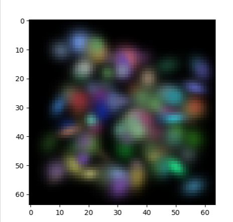
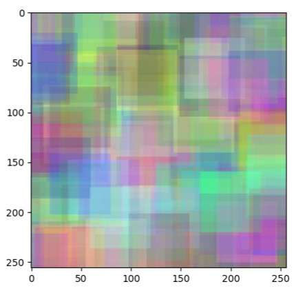

# GS2d_Triton

Gaussian Splaiting 2d implemented in triton

Cause I am not very familiar with **GPU Arch**, so the inference performance is suboptimal.

but the memory reduction is substansial! so i am very happy to share this repo to public.

Currently, when rendering **100 images with 100 x 2000 GS**, my impl only consumes 1.2 GB on 2080ti

Feel free to leave some suggestion to further improve my codebase....

### Some Rendered Images:

with rotation matrix:

without GS prob:

